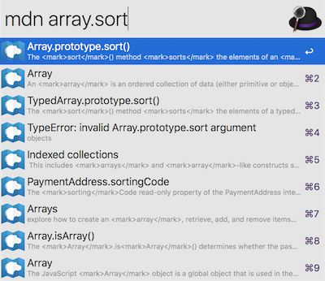

# alfred-mdn
> Search through the MDN documentation




## Install

```
$ npm install -g alfred-mdn
```

*Requires [Node.js](https://nodejs.org) 4+ and the Alfred [Powerpack](https://www.alfredapp.com/powerpack/).*


## Usage

In Alfred, type `mdn`, <kbd>Enter</kbd>, and your query.

Select an item and press <kbd>Enter</kbd> to go to its [MDN](https://developer.mozilla.org/en-US/) documentation.


## License

MIT © [Klaas Cuvelier](https://klaascuvelier.io)
